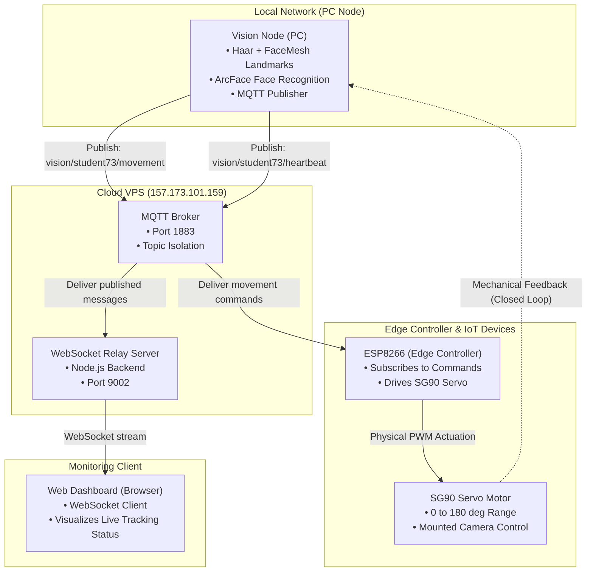

# Face Recognition with ArcFace ONNX and 5-Point Alignment


**Author:** Hatuma Charles  
**Instructor:** Gabriel Baziramwabo  
**Organization:** Rwanda Coding Academy  

This project implements a **Distributed Face Recognition and Tracking System** for IoT-based servo control using:

- **ArcFace** model (ONNX) for face recognition
- **5-point facial landmark alignment** for precise face detection
- **MQTT** for distributed communication between components
- **ESP8266** microcontroller for edge-based servo control
- **Real-time Web Dashboard** for system monitoring

The system is designed for **embedded systems applications**, demonstrating how computer vision, IoT communication, and edge computing work together in a practical face-tracking servo control system.

## Table of Contents

- [Assessment Details (Week 06)](#assessment-details-week-06)
- [System Architecture](#system-architecture)
- [Features](#features)
- [Project Structure](#project-structure)
- [Quick Start](#quick-start)
- [Usage](#usage)
- [Documentation Files](#documentation-files)

## System Architecture

This distributed system consists of four main components:

1. **Vision Node (PC)**: Detects, recognizes, and tracks faces using ArcFace and MediaPipe. Publishes movement commands via MQTT.
2. **MQTT Broker (VPS)**: Central message broker facilitating communication between all components.
3. **ESP8266 (Edge Controller)**: Subscribes to movement commands and controls a servo motor to physically track the detected face.
4. **Web Dashboard**: Real-time visualization of system status, tracking data, and lock status.

This project is configured to use the isolated MQTT topic namespace `vision/student73` so your messages do not mix with other students' traffic.

### Topology Diagram



### Sequence Flow Diagram

```mermaid
sequenceDiagram
    autonumber
    participant Camera as Local Camera
    participant PC as Vision Node (PC)
    participant MQTT as MQTT Broker (VPS)
    participant Backend as Relay Server (VPS)
    participant Web as Web Dashboard
    participant ESP as ESP8266 Node

    Camera->>PC: Capture Video Frame
    rect rgb(19, 19, 31)
        Note over PC: Haar Bbox Detection
        Note over PC: MediaPipe 5pt FaceMesh
        Note over PC: ArcFace Identification
        Note over PC: Compute Center & Actions
    end
    PC->>MQTT: Publish Movement Command (JSON)<br/>Topic: vision/student73/movement
    PC->>MQTT: Publish Health Status<br/>Topic: vision/student73/heartbeat
    MQTT->>Backend: Forward Movement Message
    MQTT->>ESP: Forward Movement Message
    Backend->>Web: Relay Broadcast over WebSocket (Port 9002)
    ESP->>ESP: Parse JSON & Check Watchdog Timeout
    alt Face Detected (MOVE_LEFT / MOVE_RIGHT)
        ESP->>ESP: Calculate PWM Delta & Adjust Servo
    else No Face Detected (NO_FACE / Timeout)
        ESP->>ESP: Run Non-blocking Horizontal Search Sweep
    end
    Web->>Web: Render status, active target & target face crop
```



## Features

- **Face Recognition & Locking**: Lock onto a specific enrolled identity and track their movements
- **Distributed Architecture**: Components communicate via MQTT, allowing flexible deployment
- **Real-time Servo Control**: ESP8266 controls servo motor based on face position
- **Live Dashboard**: Web-based monitoring with WebSocket updates
- **Action Detection**: Detects blinks, smiles, and head movements
- **CPU-friendly**: Runs on standard laptops without GPU requirements

## Project Structure

```
Face_recognition_with_Arcface/
├── src/
│   ├── vision_node.py       # Main vision processing + MQTT publisher
│   ├── face_locking.py      # Face locking & action detection
│   ├── haar_5pt.py          # Face detection core
│   └── recognize.py         # ArcFace recognition
├── backend/
│   ├── server.js            # MQTT-to-WebSocket relay
│   └── package.json
├── dashboard/
│   └── index.html           # Real-time web dashboard
├── esp8266/
│   └── vision_servo/
│       └── vision_servo.ino # Arduino firmware for ESP8266
├── data/
│   └── db/                  # Face database (face_db.npz)
└── models/
    └── embedder_arcface.onnx
```

## Documentation Files

The main assessment/report document is:

- [Distributed Vision-Control System (Face-Locked Servo).md](C:\NE\robotics\Face_recognition_with_Arcface\Distributed%20Vision-Control%20System%20(Face-Locked%20Servo).md)

The reusable documentation diagram files are:

- [docs/flow-diagram.md](C:\NE\robotics\Face_recognition_with_Arcface\docs\flow-diagram.md)
- [docs/system-architecture.md](C:\NE\robotics\Face_recognition_with_Arcface\docs\system-architecture.md)

## Quick Start

### 1. Install Dependencies
```bash
pip install -r requirements.txt
cd backend && npm install
```

### Windows Environment

This project is currently configured on this PC to use:

- Project Python: `C:\NE\robotics\Face_recognition_with_Arcface\venv310\Scripts\python.exe`
- Python version: `3.10.9`
- Local PC IP: `10.206.87.243`
- Preferred external camera index: `1`

On Windows, prefer using the project virtual environment directly instead of the global `python` command, because the global machine Python may point to a different version.

Recommended PowerShell setup from the project root:

```powershell
$env:MPLCONFIGDIR="$PWD\\.tmp\\matplotlib"
New-Item -ItemType Directory -Force -Path $env:MPLCONFIGDIR | Out-Null
```

This avoids the Matplotlib cache warning on Windows user profiles that do not allow writing to `C:\Users\<user>\.matplotlib`.

### 2. Enroll Your Face
```bash
python -m src.enroll --name charles
```

Windows:

```powershell
.\venv310\Scripts\python.exe -m src.enroll --name hatuma
```

### 3. Start the System

**On VPS (or local MQTT broker):**
```bash
mosquitto -c mosquitto.conf
```

**On PC - Terminal 1 (Backend):**
```bash
cd backend
npm start
```

**On PC - Terminal 2 (Vision Node):**
```powershell
.\venv310\Scripts\python.exe src\vision_node.py --broker 157.173.101.159 --name hatuma
```

If you are using the broker on the VPS at `157.173.101.159`, this is the correct Windows command:

```powershell
.\venv310\Scripts\python.exe src\vision_node.py --broker 157.173.101.159 --name hatuma
```

You can also run it as a module:

```powershell
.\venv310\Scripts\python.exe -m src.vision_node --broker 157.173.101.159 --name hatuma
```

Both forms work from the project root on Windows.

If you want to use the local broker on this PC instead of the VPS broker, use:

```powershell
.\venv310\Scripts\python.exe src\vision_node.py --broker 10.206.87.243 --name hatuma
```

### 3.1 Windows Run Order

Open separate PowerShell terminals in the project root and start components in this order:

1. Start the MQTT broker.
   If using VPS, make sure `157.173.101.159:1883` is reachable.
   If using local broker, start Mosquitto on this PC first.
2. Start the backend:

```powershell
cd backend
npm start
```

3. Start the vision node:

```powershell
cd ..
$env:MPLCONFIGDIR="$PWD\\.tmp\\matplotlib"
New-Item -ItemType Directory -Force -Path $env:MPLCONFIGDIR | Out-Null
.\venv310\Scripts\python.exe src\vision_node.py --broker 157.173.101.159 --name hatuma
```

4. Open the dashboard:

```text
http://localhost:8080
```

### 4. Flash ESP8266
Upload `esp8266/vision_servo/vision_servo.ino` using Arduino IDE.

Servo signal pin for this setup:

- Physical board pin: `D4`
- Arduino code pin value: `2` (`GPIO2`)

### 5. Access Dashboard
Open: [http://157.173.101.159:9313]([http://157.173.101.159:9313/])

For local Windows testing with the backend running on this PC, use:

```text
http://localhost:8080
```

## Assessment Details (Week 06)

### System Description
This project implements a **Distributed Face Recognition and Locking System** using:
1.  **Vision Node (PC)**: Detects, recognizes, and tracks faces using ArcFace and MediaPipe. Publishes movement commands.
2.  **MQTT Broker (VPS)**: Facilitates communication between the PC, ESP8266, and Dashboard.
3.  **ESP8266 (Edge)**: Subscribes to movement commands and controls a Servo motor to track the face.
4.  **Web Dashboard**: Visualizes the real-time blocking status and tracking info.

### MQTT Topics
-   `vision/student73/movement`: JSON payload with `status` (MOVE_LEFT, MOVE_RIGHT, CENTERED), `target`, and `locked` state.
-   `vision/student73/heartbeat`: System health status.

### Live Dashboard
**URL**: [http://157.173.101.159:9313/]

## Face Locking
The new Face Locking feature (`src/face_locking.py` and `vision_node.py`) allows you to track a single enrolled identity continuously.

**How it works:**
1.  **Search**: The system looks for the user using ArcFace recognition.
2.  **Lock**: Once found, it tracks the user's face position.
3.  **Action Detection**: It measures facial landmarks to detect:
    - **Blinks**: Using Eye Aspect Ratio (EAR).
    - **Smiles**: Using mouth width ratios.
    - **Movement**: Using nose position (Left/Right).

**History**:
A file named `<name>_history_<timestamp>.txt` is created to record all detected actions.
