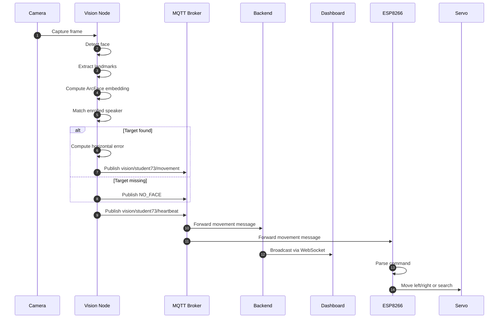
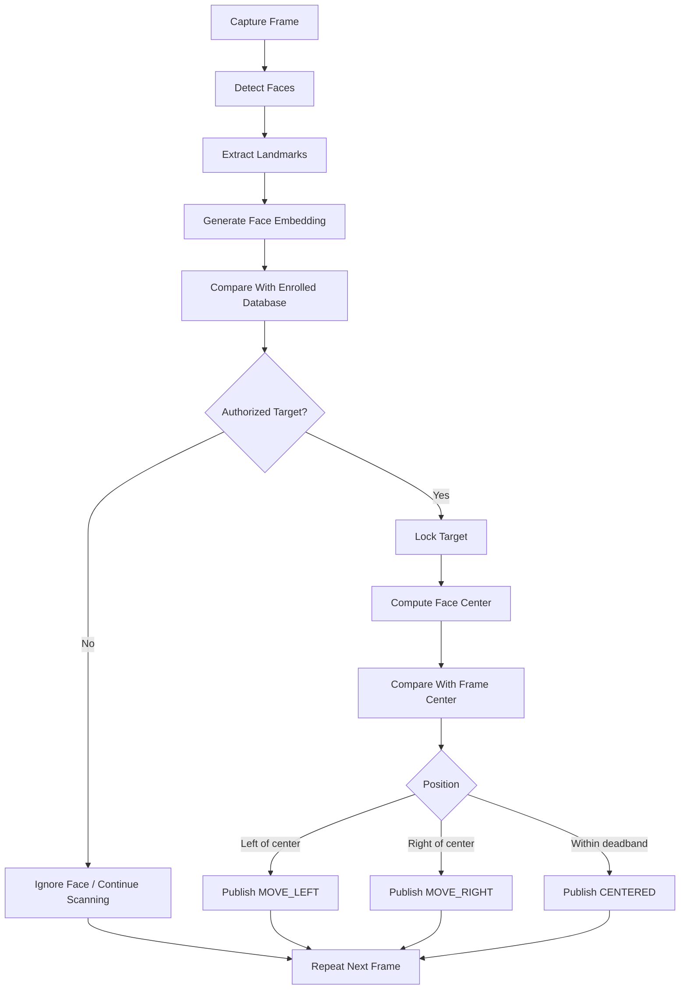

# Flow Diagrams

## End-to-End Sequence Flow

```mermaid
sequenceDiagram
    autonumber
    participant Camera as Camera
    participant PC as Vision Node
    participant MQTT as MQTT Broker
    participant BE as Backend
    participant WEB as Dashboard
    participant ESP as ESP8266
    participant Servo as Servo

    Camera->>PC: Capture frame
    PC->>PC: Detect face
    PC->>PC: Extract landmarks
    PC->>PC: Compute ArcFace embedding
    PC->>PC: Match enrolled speaker
    alt Target found
        PC->>PC: Compute horizontal error
        PC->>MQTT: Publish vision/student73/movement
    else Target missing
        PC->>MQTT: Publish NO_FACE
    end
    PC->>MQTT: Publish vision/student73/heartbeat
    MQTT->>BE: Forward movement message
    MQTT->>ESP: Forward movement message
    BE->>WEB: Broadcast via WebSocket
    ESP->>ESP: Parse command
    ESP->>Servo: Move left/right or search
```

## Recognize to Track to Command Pipeline

```mermaid
flowchart TD
    A["Capture Frame"] --> B["Detect Faces"]
    B --> C["Extract Landmarks"]
    C --> D["Generate Face Embedding"]
    D --> E["Compare With Enrolled Database"]
    E --> F{"Authorized Target?"}
    F -- "No" --> G["Ignore Face / Continue Scanning"]
    F -- "Yes" --> H["Lock Target"]
    H --> I["Compute Face Center"]
    I --> J["Compare With Frame Center"]
    J --> K{"Position"}
    K -- "Left of center" --> L["Publish MOVE_LEFT"]
    K -- "Right of center" --> M["Publish MOVE_RIGHT"]
    K -- "Within deadband" --> N["Publish CENTERED"]
    G --> O["Repeat Next Frame"]
    L --> O
    M --> O
    N --> O
```
