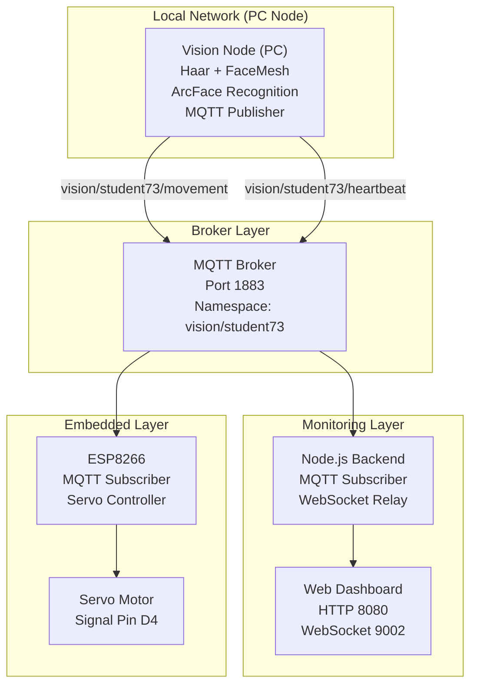
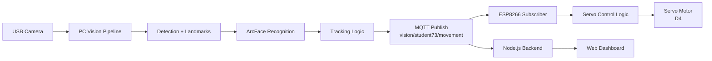

# System Architecture

## Architecture Diagram

```mermaid
graph TD
    subgraph "Local Network (PC Node)"
        VN["Vision Node (PC)<br/>Haar + FaceMesh<br/>ArcFace Recognition<br/>MQTT Publisher"]
    end

    subgraph "Broker Layer"
        Broker["MQTT Broker<br/>Port 1883<br/>Namespace: vision/student73"]
    end

    subgraph "Monitoring Layer"
        Backend["Node.js Backend<br/>MQTT Subscriber<br/>WebSocket Relay"]
        Dash["Web Dashboard<br/>HTTP 8080<br/>WebSocket 9002"]
    end

    subgraph "Embedded Layer"
        ESP["ESP8266<br/>MQTT Subscriber<br/>Servo Controller"]
        Servo["Servo Motor<br/>Signal Pin D4"]
    end

    VN -->|"vision/student73/movement"| Broker
    VN -->|"vision/student73/heartbeat"| Broker
    Broker --> Backend
    Broker --> ESP
    Backend --> Dash
    ESP --> Servo
```

## System Block Diagram

```mermaid
flowchart LR
    Camera["USB Camera"] --> Vision["PC Vision Pipeline"]
    Vision --> Detect["Detection + Landmarks"]
    Detect --> Recognize["ArcFace Recognition"]
    Recognize --> Track["Tracking Logic"]
    Track --> MQTT["MQTT Publish<br/>vision/student73/movement"]
    MQTT --> ESP["ESP8266 Subscriber"]
    ESP --> Driver["Servo Control Logic"]
    Driver --> Servo["Servo Motor<br/>D4"]
    MQTT --> Backend["Node.js Backend"]
    Backend --> Dashboard["Web Dashboard"]
```
